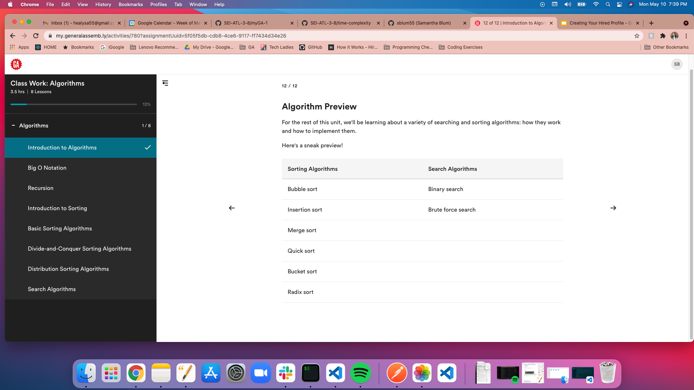
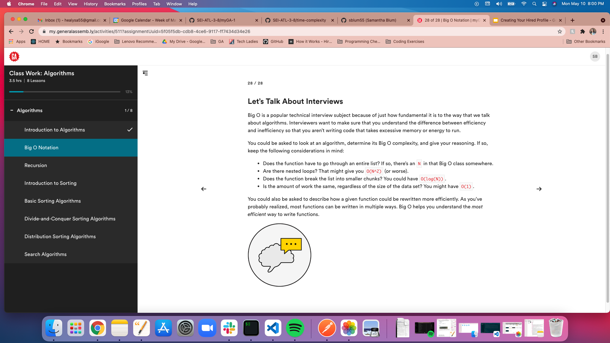
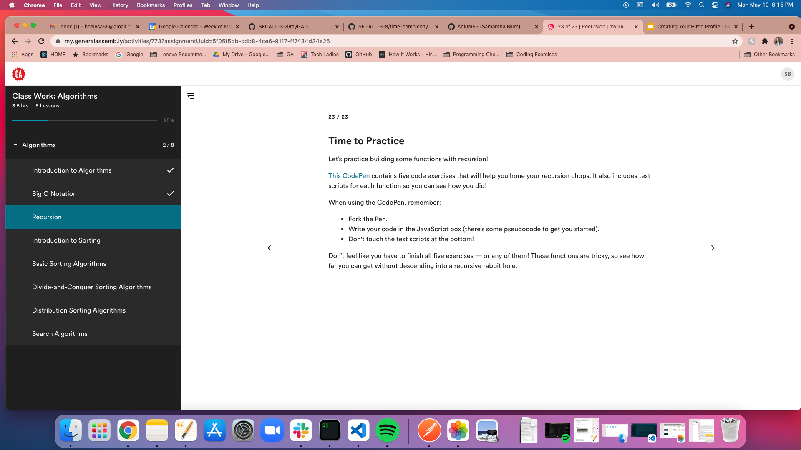
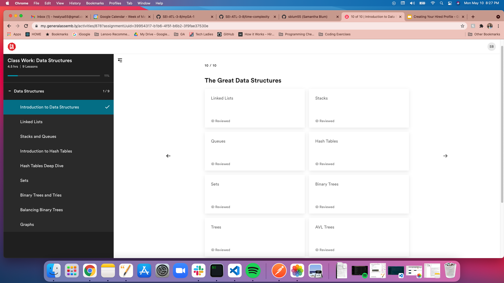
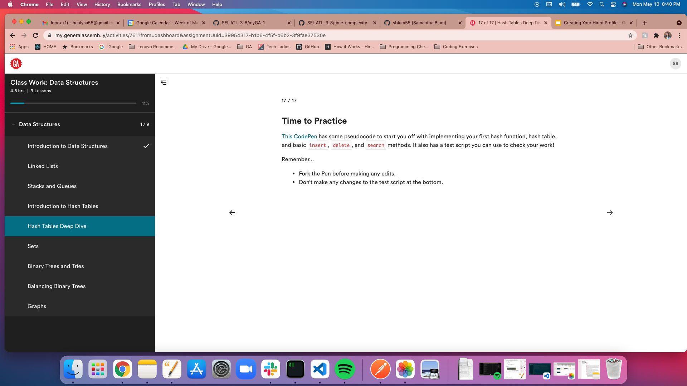

# myGA-1
Log into https://my.generalassemb.ly/

- Within the Algorithms section, do:
  - Introduction to Algorithms
  
  - Big O Notation
  
  - Recursion
  

- Within the Data Structures section, do:
  - Introduction to Hash Tables
  
  - Hash Tables Deep Dive
  

For each section, take a screencap of the final slide of that section. Put those screencaps into this folder, add & commit them, push them up to your branch, and make your pull request.